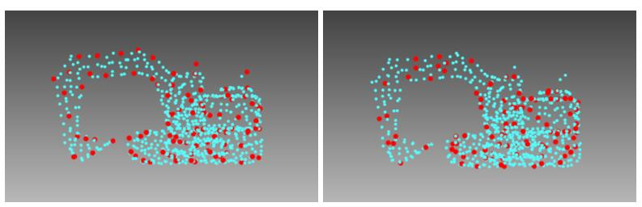
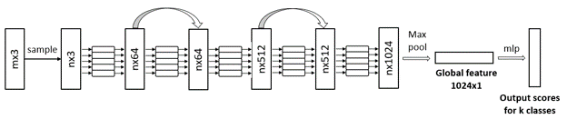
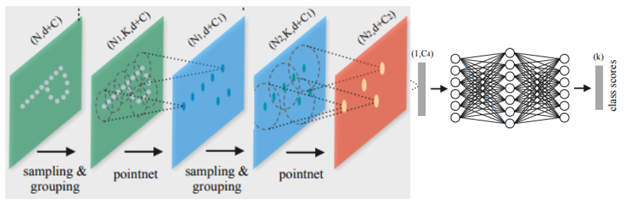
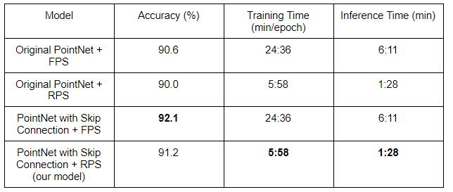

# Reconstructed PointNet++: Towards fast and robust 3D perception

## Presentation
Please find the link to our presentation here:

## 1. Introduction
Due to the development of the self-driving industry, 3D perception has been an increasingly popular topic among researchers in recent years. Aiming at understanding complex real-world 3D environments, both model accuracy and inference speed are important factors for developing robust and reliable 3D perception systems.

One main branch of 3D feature learning is directly taking the point cloud as input and outputs for learning representation of the point cloud [1], [3]. This kind of point-based method preserves the spatial information of 3D data compared to convolutional methods but results in low processing speed due to the high computational complexity. The state-of-the-art method PVRCNN [3], has top performance in 3D detection among published methods on KITTI [4] benchmark, but cannot be processed on large point cloud inputs in real-time .

Considering such circumstances, we state our problem as improving the point-based methods to meet the real-time processing demands while maintaining the performance and reliability of the 3D perception models.

## 2. Related Work
**PointNet** [1]: PointNet is one of the pioneers’ works in the field of 3D data understanding. Instead of converting the point cloud to other representations, such as voxel and graph, PointNet directly takes point cloud as input and outputs either class labels for the entire point cloud or per point labels for segmentation tasks. The big advantage of processing point cloud directly is that the original information is well preserved. Also, compared with voxel representation, which carries voluminous and unnecessary data, point cloud representation is much more compact and thus requires less rendering resources. 

PointNet++ [2]: Although PointNet demonstrates excellent performance in classification, its capability for segmentation is limited because it does not capture local structures. PointNet++ solved this problem by introducing a new method called set abstraction. It can capture local features at multiple scales and achieves significantly better performance than the SOTAs.

PVRCNN [3]: Shi et al. [c] proposed a PointVoxel-RCNN (PV-RCNN) framework, which combines 3D convolutional network and PointNet-based set abstraction for the learning of point cloud features. The voxelized input points are fed into a 3D convolutional network to generate high-quality proposals. The learned voxel-wise features are then encoded into a small set of key points via a voxel set abstraction module to generate 3D bounding boxes.

All of these aforementioned methods rely on the Farthest Point Sampling(FPS) method for selecting key points from the original point cloud. This process is of high computation complexity and makes it impossible to process large point cloud inputs in real time. We proposed our Random Sampling(RS) based restructured model to speedup the forward process of such point-based methods and preserve the model performance to the maximum extent.

## 3. Dataset
For our project, we have identified two main data sources for model training:

ShapeNet: ShapeNet is a richly annotated, large-scale repository of shapes represented by 3D CAD models of objects. It contains 3D models from a multitude of semantic categories and organizes them under the WordNet taxonomy. It is a collection of datasets providing many semantic annotations for each 3D model.

ModelNet40: This dataset provides researchers in computer vision, computer graphics, robotics, and cognitive science, with a comprehensive clean collection of 3D CAD models for objects. It contains 12,311 pre-aligned shapes from 40 categories, which are split into 9,843 (80%) for training and 2,468 (20%) for testing. The CAD models are in Object File Format (OFF). To make this dataset work for our project, we sampled randomly from the CAD model surface to get ground truth point clouds with related labels.

## 4. Methodology
#### 4.1. Sampling Method
Processing point clouds with a  deep neural network inevitably requires those points to be progressively and efficiently downsampled in each neural layer without losing useful features. While implementing the classification algorithms, we find that the speed of downsampling points largely affects the whole processing time. Therefore, we analyze and compare their relative merits and complexity as follows.

Inverse Density Importance Sampling (IDIS) To sample out K points, IDIS reorders all points according to the density of the points. The density of each point is calculated from the added euclidean distance from its neighbors. The computational complexity of this method is approximately O(N). It takes 10 seconds to process 10^6 points. However, it is not so efficient enough and very sensitive to outliers. Therefore, we are considering the two following sampling methods.

Farthest Point Sampling (FPS) In order to sample K points from an input point cloud P, FPS returns a reordering of the metric space {p1 pk pK}, such that each pkis the farthest point from the first k-1points. Although FPS has good coverage of the entire point set, its computational complexity is O(N2). For a large point set with 10^6 points, FPS takes up to 200 seconds to process on a single GPU. This shows that FPS is not suitable for large-scale point clouds.

Random Point Sampling (RPS) Random sampling uniformly selects K points from the original point clouds. Its computational complexity is O(1). Compared with IDIS and FPS, RPS has the highest computational efficiency, regardless of the scale of the input point clouds. The experiment shows that it only takes 0.004s to process 10^6 points. Although RPS may discard certain useful features, we make certain modifications to our model to better aggregate the features. Figure below visualizes sampling results using FPS (left) and RPS (right). We implement both of them in our network and make a comparison with their final performance in the Experiment part.

  

#### 4.2. Modified PointNet
PointNet is one of the pioneer works in point cloud classification and segmentation. It uses multi-layer perceptrons to map point features from low dimension to high dimension. The original PointNet also predicts an affine transformation matrix to align features to a canonical space. In this paper, we implemented our own version of PointNet. We 1) added skip connection between convolution layers to improve feature extraction and 2) removed affine transformation prediction to reduce computation. These modifications significantly improve processing speed compared to the original PointNet while still retaining the feature extraction capability. The new architecture is shown in Figure (**). 

A detailed explanation of the model architecture is provided as follows. The input points (m x 3) are first downsampled to a uniform size (n x 3). We then applied multiple layers of 1D convolution to increase the feature dimension. Between convolutional layers we added skip connection in order to maintain local features during forward propagation. After the final convolutional layer, a max pooling operation was applied to extract the global feature. This operation is invariant to the order of points and therefore works effectively as a point cloud global feature extractor. The global feature is finally fed into a fully connected layer for classification.

  

#### 4.3. Reconstructed PointNet++
Although PointNet demonstrates the possibility to directly process on raw point clouds, its performance is limited due to the fact that spatial relation between points is not considered during inference. Therefore, PointNet++ [2] was proposed to compensate for this drawback. The key component in PointNet++ is a set abstraction module (visualized in Figure 3). Simply speaking, set abstraction uses a certain sampling method (FPS, RPS, etc) to extract n key points in the point cloud. For each key point, its neighborhood is formed by its n nearest neighbors and itself. Thus, we then acquire n neighborhoods that describe the input point cloud. During feature extraction, a PointNet is applied to each neighborhood, resulting in n features (one feature vector for each neighborhood). The same grouping and sampling process is then repeated on these features, until the final feature becomes descriptive enough. This final feature will be fed into a fully connected layer for classification. The original implementation uses FPS for sampling. However, as stated in Section 4, FPS is computationally expensive and therefore not suitable for real-time application. In our reconstructed PointNet++, we implemented RPS that significantly boosted the speed performance. We also utilized the modified PointNet for feature extraction, which also reduces the complexity. 

  

## 5. Experiments
We performed an ablation study comparing our Reconstructed PointNet++ with other PointNet++ architectures. The performance is evaluated by classification accuracy and training/inference speed. All experiments were performed on an AWS g4dn.xlarge instance, with results shown in Table 1. We observed that by changing the sampling method from FPS to RPS, the training and inference speed become four times faster, with a small drop of classification accuracy. By adding skip connection to PointNet, this drop is compensated, with accuracy raised from 90.0% to 91.2%. Overall, compared with the original PointNet++ implementation (original PointNet + FPS), our reconstructed PointNet++ is four times faster while producing a better classification score. This exhibits the efficiency and accuracy of reconstructed PointNet++. 

  

## 6. Conclusion
We proposed a reconstructed point-based 3D feature learning method to meet the real-time processing demands and preserve the model performance. 
Specifically, we speeded up the training and evaluation process of the PointNet model dramatically and reached comparable performance with the original model. We also reduced redundancy of the network structure without affecting final performance and reliability. 
We believe that our work could be beneficial to various areas in 3D perception, such as real-time lidar classification, detection, etc. As for future steps, we would like to apply our proposed method on complex and SOTA models for further improvements and evaluation.

## Reference
[1] Qi, C. R., Su, H., Mo, K., and Guibas, L. J., “PointNet: Deep Learning on Point Sets for 3D Classification and Segmentation”, <i>arXiv e-prints</i>, 2016.
[2] Qi, C. R., Yi, L., Su, H., and Guibas, L. J., “PointNet++: Deep Hierarchical Feature Learning on Point Sets in a Metric Space”, <i>arXiv e-prints</i>, 2017.
[3] Shi, S., “PV-RCNN: Point-Voxel Feature Set Abstraction for 3D Object Detection”, <i>arXiv e-prints</i>, 2019.
[4] A. Geiger, P. Lenz, and R. Urtasun, “Are we ready for autonomous driving,” in CVPR, 2012. 
